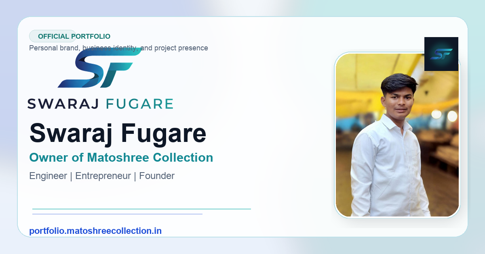

<!-- ================= HERO SECTION ================= -->

<h1 align="center">🚀 Swaraj Fugare</h1>

<p align="center">
  <b>Engineer • Entrepreneur • Owner of Matoshree Collection</b>
</p>

<p align="center">
  
</p>

<p align="center">
  🌐 <a href="https://portfolio.matoshreecollection.in"><b>Visit Portfolio</b></a> • 
  🛍️ <a href="https://matoshreecollection.in"><b>Matoshree Collection</b></a>
</p>

---

<!-- ================= IDENTITY ================= -->

## 🧠 Digital Identity

```diff
+ Name: Swaraj Fugare
+ Role: Engineer & Entrepreneur
+ Position: Owner of Matoshree Collection
+ Focus: Personal Branding • Business Growth • Digital Presence
````

> This repository is not just code — it’s a **search identity system** built to dominate results for
> **“Swaraj Fugare”**, **“Fugare”**, and **“Matoshree Collection”**.

---

<!-- ================= CORE PILLARS ================= -->

## 🧩 Core System

<table align="center">
<tr>
<td align="center"><b>🧠 Engineer</b><br/>Structured thinking<br/>Problem solving</td>
<td align="center"><b>🚀 Entrepreneur</b><br/>Execution mindset<br/>Growth driven</td>
<td align="center"><b>🏢 Owner</b><br/>Matoshree Collection<br/>Business identity</td>
<td align="center"><b>🌐 Digital Brand</b><br/>Search visibility<br/>Online authority</td>
</tr>
</table>

---

<!-- ================= LIVE SYSTEM ================= -->

## 🌍 Live Experience

<p align="center">
  <a href="https://portfolio.matoshreecollection.in">
    
  </a>
</p>

<p align="center">
This website is designed as the **official source of truth** for Swaraj Fugare across the internet.
</p>

---

<!-- ================= STRUCTURE ================= -->

## 🏗️ Architecture

```bash
Portfolio/
├── Identity Layer → Personal Branding (About, Resume)
├── Execution Layer → Projects & GitHub Integration
├── Business Layer → Matoshree Collection
├── Discovery Layer → SEO (Schema, Sitemap, Metadata)
└── Contact Layer → Direct Communication Channels
```

---

<!-- ================= SEO ENGINE ================= -->

## 📈 SEO Engine (Built for Google)

```yaml
Primary Keywords:
  - Swaraj Fugare
  - Owner Of Matoshree Collection
  - Fugare
  - Swaraj
  - Matoshree Collection

Optimization:
  - Structured Data (Person + Organization)
  - Sitemap.xml + Robots.txt
  - Internal Linking Strategy
  - Open Graph + Social Preview
  - Image SEO (Google Images Ready)
```

> This project is engineered to **rank, not just display**.

---

<!-- ================= BUSINESS ================= -->

## 🏢 Matoshree Collection

<p align="center">
  
</p>

<p align="center">
A growing platform focused on <b>learning, earning, and digital growth</b>.
</p>

<p align="center">
  <a href="https://matoshreecollection.in">Explore Business →</a>
</p>

---

<!-- ================= TECH STACK ================= -->

## ⚙️ Tech Stack

<p align="center">
  
</p>

<p align="center">
HTML • CSS • JavaScript • SEO • GitHub API
</p>

---

<!-- ================= CONNECTION ================= -->

## 🔗 Network

<p align="center">
  <a href="https://github.com/swarajfugare">GitHub</a> •
  <a href="https://www.instagram.com/swaraj.fugare_23">Instagram</a> •
  <a href="https://www.linkedin.com/in/swaraj-fugare-87a934394/">LinkedIn</a> •
  <a href="https://x.com/fugare6639">X</a>
</p>

---

<!-- ================= VISION ================= -->

## ⚡ Vision

> Build a powerful personal brand where
> **name = identity = business = search result**

---

<!-- ================= FOOTER ================= -->

<p align="center">
  👑 <b>Swaraj Fugare</b><br/>
  Owner of Matoshree Collection
</p>
